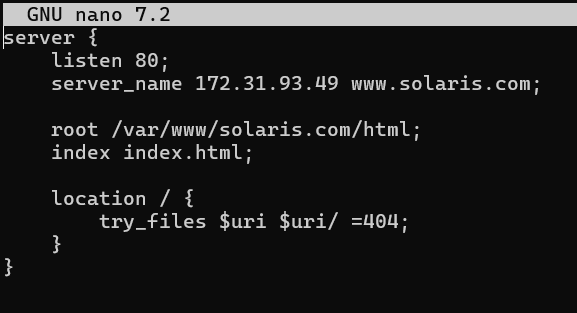
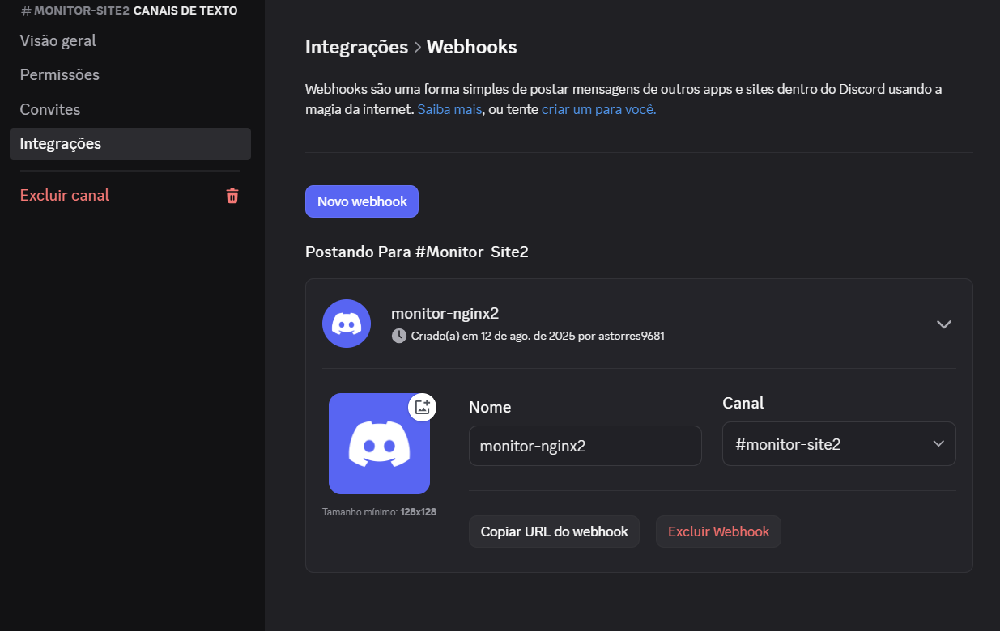
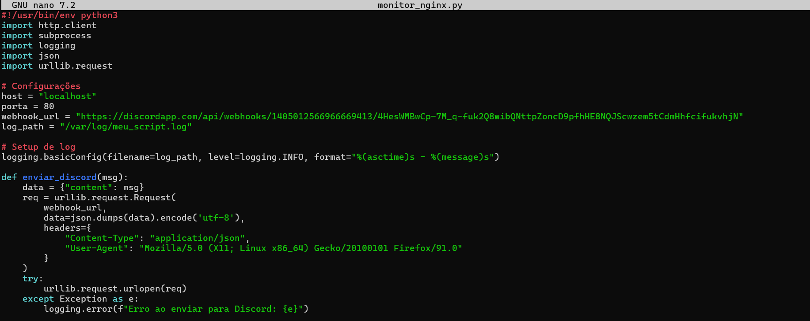
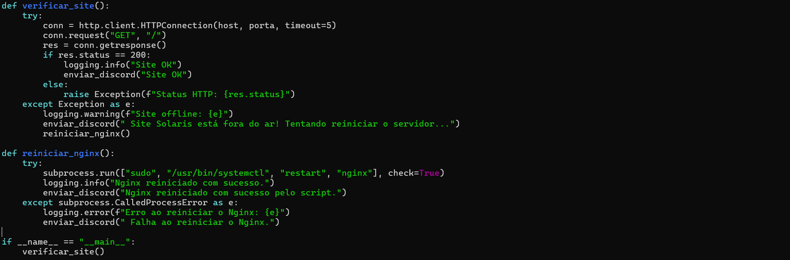
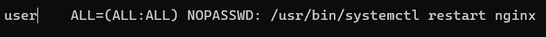
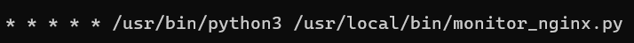

# Desafio1.Compass

# ✅ Objetivo: Criar um servidor Nginx que hospeda uma página HTML e é monitorado via Python, com alertas automáticos via Discord.

# 📦 Tecnologias 
- Ubuntu (WSL ou nativo)
- Nginx
- Python 3 
- Discord Webhooks
- Cron

# 1.Preparando o ambiente Linux 
1.1- Instalar o WSL + Ubuntu digitando no cmd o comando: wsl --install -d Ubuntu

1.2- Execute o Ubuntu com o comando: wsl -d Ubuntu

1.3- atualizar o sistema com os comandos: apt-get update && apt-get upgrade

--------------------------------------------------------------------------------------------------------------------------------------------------------------------

# 2.Configurando o servidor web NGINX 
2.1- Instale o Nginx digitando o comando: apt-get install nginx -y

2.2- Verifique se o Nginx está rodando escrevendo o comando: systemctl status nginx

2.3- Verifique seu ip(Exemplo: 172.31.93.49) digitando: ip a

2.4- para confirmar abra o navegador e digite seu endereço ip na barra de navegação para ver se aparece a pagina do nginx

2.5- Crie a estrutura para o seu site, Exemplo: mkdir -p var/www/solaris.com/html

2.6- dê permissão para o usuário em todos os arquivos usando o comando: chown -R $USER:$USER /var/www/solaris.com/html

2.7- Crie uma página HTML: nano /var/www/solaris.com/html/index.html

2.8- Crie um novo server block(configuração que define como o Nginx deve responder a requisições para um determinado domínio ou IP) escrevendo o comando: nano /etc/nginx/sites-available/solaris.com

Exemplo:

--------------------------------------------------------------------------------------------------------------------------------------------------------------------

2.9- Crie um link simbólico escrevendo o código na pasta sites-enabled: ln -s /etc/nginx/sites-available/solaris.com /etc/nginx/sites-enabled/

2.10- Teste se tem algum erro de configuração escrevendo o código: nginx -t

2.11- reinicie o nginx escrevendo: systemctl reload nginx

2.12- desative o site padrão com os códigos: rm /etc/nginx/sites-enabled/default e rm /etc/nginx/sites-available/default

2.13- Dê permissão para o nginx acessar sua pasta digitando: chmod o+x /var/www/solaris.com/html 

2.14- Garantir reinício automático do Nginx com o sistema: systemctl enable nginx

2.15- teste se está funcionando digitando o ip no navegador 

--------------------------------------------------------------------------------------------------------------------------------------------------------------------

# 3.Preparando o WebHook do Discord 
3.1- baixe e instale o discord, crie sua conta e entre nela

3.2- Crie um servidor no discord clicando no + na barra lateral esquerda e escolha "Criar meu próprio Servidor"

3.3- vá até um canal de texto do servidor(Exemplo #geral) e clique no ícone de engrenagem ao lado do canal:

--------------------------------------------------------------------------------------------------------------------------------------------------------------------

3.4- vá em integrações > Webhooks, depois clique em "Webhooks" dentro do menu de configurações do canal

3.5- Clique em "Novo Webhook" e escolha um nome, escolha um canal onde ele deve postar e clique em copiar a URL do WebHook

3.6- Salve as mudanças no Discord

--------------------------------------------------------------------------------------------------------------------------------------------------------------------

# 4.Script de Monitoramento + WebHook 
4.1- crie um script para monitorar o status do site utilizando o comando: nano /usr/local/bin/monitor_nginx.py

4.2- altere o script monitor_nginx.py para monitorar quando o site está fora de ar e quando está funcionando

--------------------------------------------------------------------------------------------------------------------------------------------------------------------

4.3- Dê permissão de execução utilizando o comando: chmod +x /usr/local/bin/monitor_nginx.py

4.4- Crie um arquivo de log, utilize o comando: touch /var/log/meu_script.log

4.5- dê permissão de leitura e escrita para o arquivo meu_script.log, utilize o código: chmod 666 /var/log/meu_script.log

4.6- Abra o visudo para configurar sudo sem senha para reiniciar o nginx, digite: visudo

4.7 adicione no final do arquivo a linha:

 

4.8- Faça que o script monitor_nginx.py rode a cada 1 minuto, Abra o editor do seu crontab pessoal, escrevendo o código: crontab -e

4.9- escolha a opção do editor nano para abrir o arquivo

4.10- escreva no final do arquivo que foi aberto:

--------------------------------------------------------------------------------------------------------------------------------------------------------------------

# 5. Testando a implementação 

5.1- Você pode ver se seu site está no ar digitando o endereço de ip no navegador

5.2- Você pode ver como é o código html da sua index digitando: curl http://localhost

5.3- Para verificar o seu arquivo .logo digite: cat /var/log/meu_script.log

5.4- Teste manual para executar o script e a mensagem chegar no discord: python3  /usr/local/bin/monitor_solaris.py
  
5.5- Pare o NGINX para ver se também chega mensagem no discord: systemctl stop nginx

5.6- Após para o NGINX espere 1 minuto para receber a mensagem que ele está fora do ar e está tentando reiniciar

--------------------------------------------------------------------------------------------------------------------------------------------------------------------

